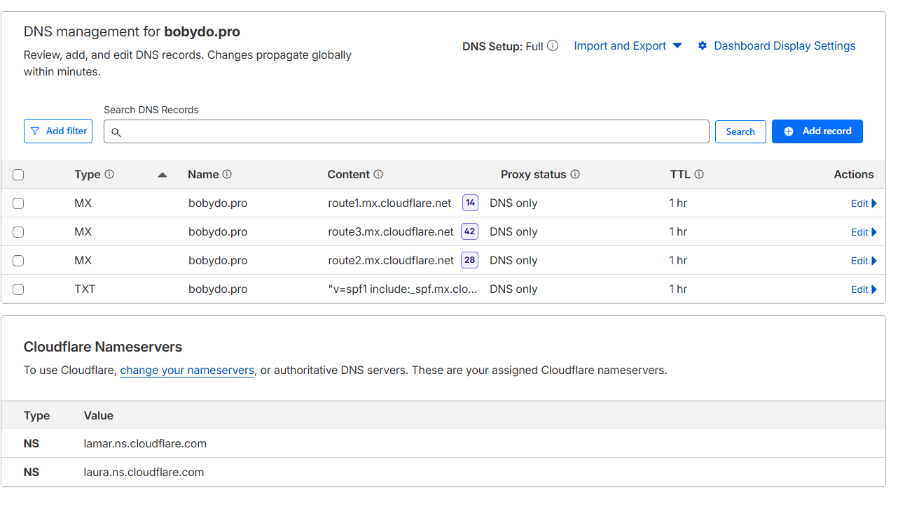
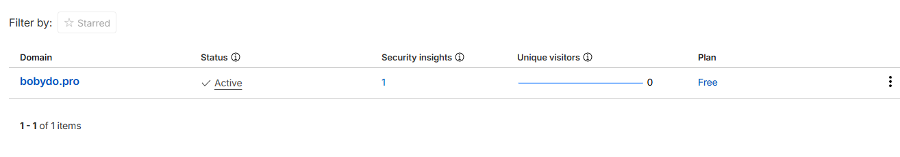
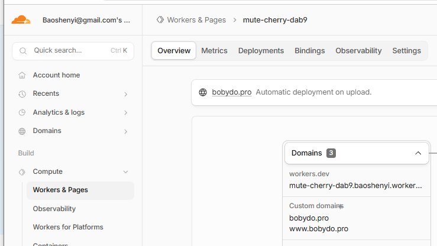
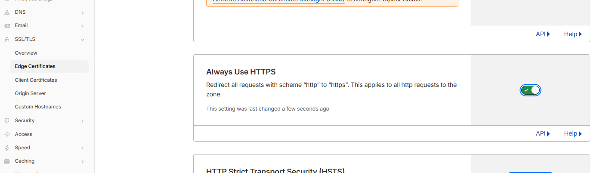

# bobydo.pro — Setup Guide

## Status Summary

| Step | Task | Status |
|------|------|--------|
| 1 | Add bobydo.pro domain to Cloudflare | ✅ Done |
| 2 | Upload bobydo-dns.txt to Cloudflare DNS | ✅ Done |
| 3 | Fix nameservers in Porkbun (alberto/frida → lamar/laura) | ✅ Done |
| 4 | Cloudflare detects correct nameservers | ⏳ Wait 24–48 hrs |
| 5 | Enable Email Routing (contact@bobydo.pro) | After step 4 |
| 6 | Deploy site to Cloudflare Pages | After step 4 |

---

## Step 1 — Add Domain to Cloudflare (Done)

1. Go to [Cloudflare Dashboard](https://dash.cloudflare.com) → **Add a domain**
2. Enter `bobydo.pro` → select **Free plan** → continue

---

## Step 2 — Upload DNS Records (Done)

Imported via `bobydo-dns.txt` → Cloudflare DNS → Import and Export → Import DNS Records.

| Type | Name | Content | Priority | TTL |
|------|------|---------|----------|-----|
| MX | bobydo.pro | route1.mx.cloudflare.net | 14 | 1 hr |
| MX | bobydo.pro | route2.mx.cloudflare.net | 28 | 1 hr |
| MX | bobydo.pro | route3.mx.cloudflare.net | 42 | 1 hr |
| TXT | bobydo.pro | v=spf1 include:_spf.mx.cloudflare.net ~all | — | 1 hr |

---

## Step 2 — Nameserver Fix in Porkbun (Done)

**Problem:** Porkbun had wrong Cloudflare nameservers (alberto/frida — belong to a different account).

**Porkbun original nameservers:**
alberto.ns.cloudflare.com
frida.ns.cloudflare.com

**Fixed to (your assigned Cloudflare nameservers):**
- `lamar.ns.cloudflare.com`
- `laura.ns.cloudflare.com`

**How long to wait:** 24–48 hours for global DNS propagation. Cloudflare will send an email when it detects the correct nameservers.

To check propagation progress: https://dnschecker.org/#NS/bobydo.pro

---

## Step 3 — Enable Email Routing (After nameservers confirmed)

1. Cloudflare → `bobydo.pro` → **Email** → **Email Routing**
2. Click Routing rules tab (top of the page) → Create address
3. Add forwarding rule:
   - From: `contact@bobydo.pro`
   - To: your Gmail (baoshenyi@gmail.com)
4. Click the verification link Cloudflare sends to your Gmail
5. Enable Email Routing

Any email to `contact@bobydo.pro` will forward to your Gmail automatically.

---

## Step 4 — Deploy Site to Cloudflare Pages (After nameservers confirmed)

1. Cloudflare → **Workers & Pages** → **Create** → **Pages** → **Upload assets**
2. Name the project: `bobydo-site`
3. Upload `index.html` → click **Deploy**
4. Inside the Pages project → **Custom domains** → **Set up a custom domain**
5. Type `bobydo.pro` → Cloudflare automatically adds the DNS CNAME record
6. `https://bobydo.pro` goes live with free SSL in minutes

---

## Cloudflare Dashboard Links

- DNS Records: https://dash.cloudflare.com/e6f74de28b7ee985e010db5b9aa93162/bobydo.pro/dns/records
- Email Routing: https://dash.cloudflare.com/e6f74de28b7ee985e010db5b9aa93162/bobydo.pro/email/routing
- Domains Overview: https://dash.cloudflare.com/e6f74de28b7ee985e010db5b9aa93162/domains/overview
