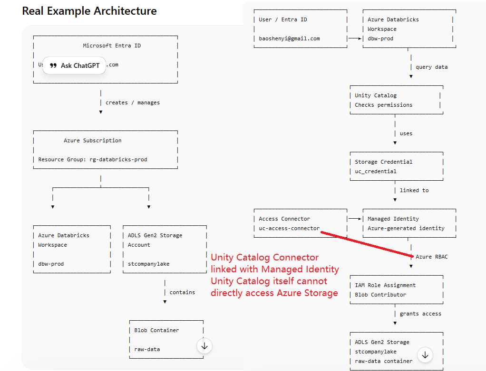

# Databricks on Azure

This folder contains notes and diagrams for setting up and understanding Databricks with Azure infrastructure.

---

## Control

How Unity Catalog authenticates and accesses Azure Storage:

- Unity Catalog says: **"I want this table/data"**
- Azure says: **"Who are you?"**
- Unity Catalog: **"I use this Managed Identity"**
- Azure RBAC checks: **"Does this identity have Blob Contributor?"**

```
If YES → storage access allowed
```


