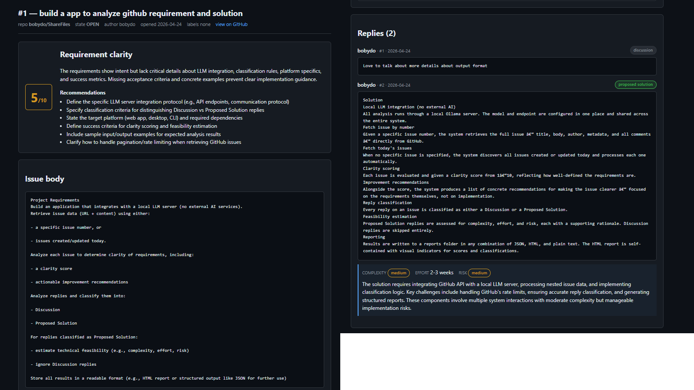

````markdown
# Requirement and Solution Analyzer

This tool helps bridge unclear issues into actionable technical plans:

- **Clarify Requirements**
  - Detect ambiguity, missing details, unclear scope
  - Suggest specific questions to refine requirements

- **Propose Technical Solution**
  - Categorize issue (bug / feature / discussion)
  - Suggest possible implementation approaches

- **Estimate Feasibility**
  - Complexity: Low / Medium / High
  - Effort: Hours / Days
  - Risk: Dependencies, unclear scope, edge cases

## Tech
- **Model:** `OLLAMA_MODEL = "qwen3:8b"` (for security purpose)
- **Language:** Python
- **Libraries:** Python standard libraries only

## Setup

### Initialize Virtual Environment
```bash
PS D:\ShareFiles\GitHubIssueMCP> uv venv
````

Output:

```bash
Using CPython 3.13.7 interpreter at: C:\Python313\python.exe
Creating virtual environment at: .venv
Activate with: .venv\Scripts\activate
```

## Test Issues

* https://github.com/bobydo/ShareFiles/issues

## Commands

```bash
uv run python analyze_issues.py --repo bobydo/ShareFiles --issue 1
uv run python analyze_issues.py --repo bobydo/ShareFiles --issue 1
```

## Result
- Real report https://github.com/bobydo/ShareFiles/tree/main/GitHubIssueMCP/reports
- **Issue:**  
- **Skip Discussion Reply:**  
- **Technical Feasibility (complexity / effort / risk):**  


## Future Improvements

- **RAG-based Knowledge Base**
  - Analyze existing requirements, discussions, and solutions
  - Build a searchable knowledge base for better recommendations

- **Similar Solution Detection**
  - Identify related past issues and solutions
  - Support smarter suggestions during issue analysis

- **AI-assisted Code Review**
  - Detect common issues and improvement patterns
  - Suggest fixes based on historical solutions
