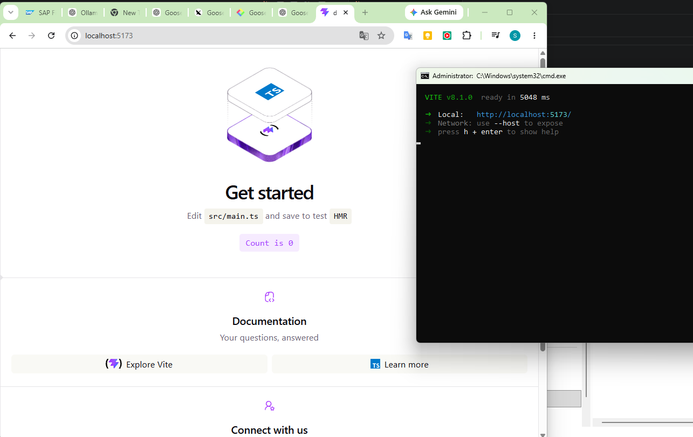

# Goose

## Reference

Follow up https://goose-docs.ai/blog/2025/05/12/local-goose-qwen3/?utm_source=chatgpt.com

## Task

Create a new React + TypeScript application.

Project folder:

D:\DogGallery

If the folder does not exist, create it.

- Use Vite.
- Use Zustand.
- Use plain CSS only.
- Do not use Tailwind.

## Execution

- Automatically execute all required terminal commands.
- Continue until:
  - npm install succeeds
  - project builds successfully
  - npm run dev starts without errors
- If any command fails, fix it automatically and continue.
- Do not stop after planning.

```
cd D:\DogGallery\dog-gallery
npm install
npm run dev
```

## Result

Local open models are still behind Claude Code or GPT-5.5 for autonomous coding agents — but not as far behind as the earlier stalled run made it look. Once the instructions explicitly forbade stopping after planning and forced execution, `qwen3:8b` via Goose actually drove the scaffold-install-run loop through to a working dev server.

One telling line from the agent's own reasoning trace, while it was debugging its repeated tool-call cancellations:

> "The repeated cancellations suggest an external interruption..."



## Working in Smaller Steps

Breaking the build into discrete, verifiable steps — rather than one large autonomous spec — made the small model far more reliable:

1. Create the Vite React TypeScript project. (wait until it works)
2. Install Zustand. Create the store.
3. Create the Dog API service.
4. Create the Favorites page.
5. Improve the UI using plain CSS.

This is exactly how professional AI-assisted coding works today: smaller tasks mean fewer failures and easier recovery.

