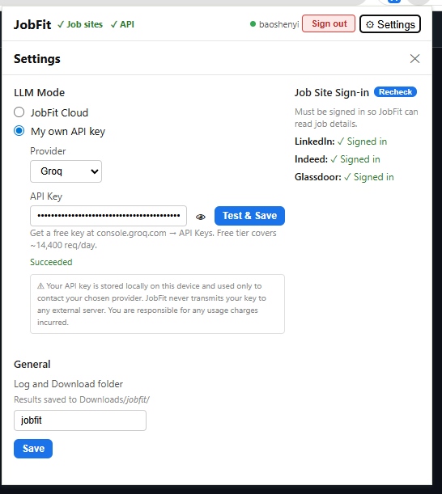
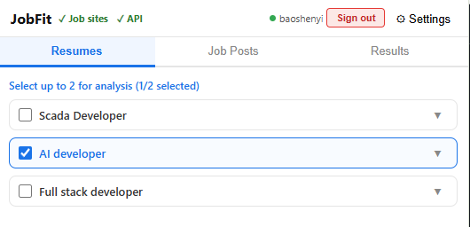
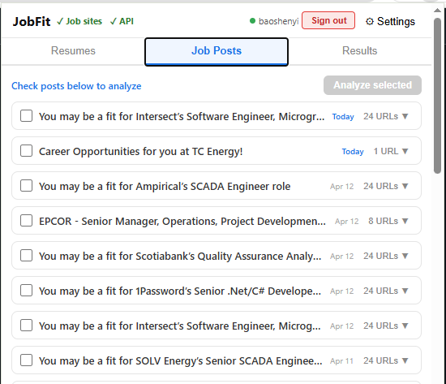
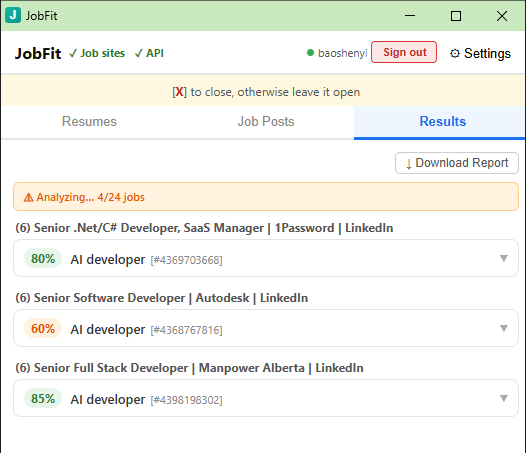

# JobFit — AI Resume-to-Job Matcher

> A Chrome extension that reads your Gmail inbox and uses AI to score how well your resume matches each job posting — instantly.

---

## The Problem

Applying for jobs is time-consuming. You receive dozens of job alert emails from LinkedIn, Indeed, and Glassdoor, but manually reading each posting and deciding if it fits your background takes hours. Most people either apply to everything (wasted effort) or miss good opportunities.

## What JobFit Does

JobFit sits inside Gmail as a Chrome extension. It reads your saved resumes and incoming job alerts, then uses AI to produce a **match score (0–100%)** and a **skills gap analysis** for every resume-job combination — in one click.

---

## How It Works

### Step 1 — Label your emails in Gmail
Create two Gmail labels:
- **`resumes`** — apply this to any email containing your resume text in the body
- **`jobposts`** — apply this to job alert emails from LinkedIn, Indeed, Glassdoor, etc.

### Step 2 — Choose your AI provider
JobFit works with several AI providers. The easiest free option is **Groq** (~14,400 free requests/day):
1. Sign up at [console.groq.com](https://console.groq.com/keys)
2. Create an API key
3. Paste it into JobFit Settings → My own API key → Groq

### Step 3 — Analyze
1. Open the JobFit extension
2. Select your resume(s) in the **Resumes** tab
3. Check the job posts you want to analyze in the **Job Posts** tab
4. Click **Analyze selected**
5. View your scores in the **Results** tab

---

## Features

### Resumes Tab
- Automatically loads all emails from your `resumes` Gmail label
- Select up to 2 resumes for simultaneous comparison (configurable up to 5)
- Expand any resume to view the full text inline

### Job Posts Tab
- Automatically loads all emails from your `jobposts` Gmail label
- Extracts job posting URLs from each email
- Tracks which jobs you've already analyzed (✓ Done badge)
- Warns when old job posts (10+ days) are still in your inbox

### Results Tab
- **Match score** per resume-job pair with colour coding:
  - Green (70%+) — strong fit
  - Orange (40–69%) — partial fit
  - Red (0–39%) — poor fit
- **AI-generated summary** explaining why the resume fits or doesn't
- **Skills gap list** — specific skills the job requires that are missing from your resume
- **Download Report** — export all results as a formatted HTML file

### Settings
- Switch between LLM providers at any time
- Check sign-in status for LinkedIn, Indeed, and Glassdoor
- Configure download folder and analysis limits

---

## Supported AI Providers

| Provider | Cost | Notes |
|---|---|---|
| **Groq** | Free tier (~14,400 req/day) | Recommended for getting started |
| **OpenAI** | Pay-per-use | GPT-4o mini |
| **Anthropic** | Pay-per-use | Claude Haiku |
| **JobFit Cloud** | $11/month | Managed, no key needed |

---

## Supported Job Sites

JobFit can fetch and analyze job postings from:
- LinkedIn
- Indeed
- Glassdoor
- Any other site linked in your job alert emails

---

## Privacy & Security

- Your API keys are stored **locally on your device only** — never sent to any external server
- JobFit only reads emails from your `resumes` and `jobposts` labels — nothing else
- Gmail access uses standard Google OAuth — you can revoke it at any time
- Analysis results are stored locally and auto-cleared after 24 hours

---

## Demo Flow (5 minutes)

1. Open extension → show **Resumes tab** (resumes loaded from Gmail)
2. Switch to **Job Posts tab** → check 2–3 jobs → click **Analyze selected**
3. New analysis window opens → watch scores appear live
4. Switch to **Results tab** → expand a result → show score, summary, skills gap
5. Click **Download Report** → open the HTML file

---

*Built for job seekers who want signal, not noise.*

## Demo Image

