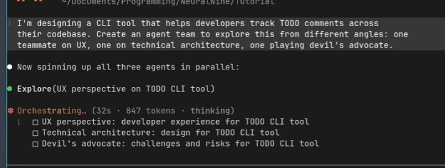

# OODClaude — OOP & Design Pattern Standards for Claude Code

This folder defines coding standards and skills that enforce object-oriented design and design patterns across all Claude Code sessions.

---

## Structure

```
OODClaude/
  CLAUDE.md                          ← Always-on rules (applied automatically to every session)

C:\Users\<user_id>\.claude\
  CLAUDE.md                          ← Global copy — same rules loaded into every project
  skills/
    object-oriented-design/
      SKILL.md                       ← /object-oriented-design skill
    design-patterns/
      SKILL.md                       ← /design-patterns skill
```

---

## How It Works

### CLAUDE.md — Passive (Always On)
Rules defined here are loaded automatically into every Claude Code session. Claude applies OOP principles and design patterns by default without being asked.

### Skills — Active (On Demand)
Invoked explicitly when you want a focused review or pattern implementation on a specific piece of code.

---

## Skills Usage

### `/object-oriented-design <prompt>`
Review and refactor code for OOP violations.

```
/object-oriented-design refactor this file to remove @staticmethod and inject dependencies via __init__
/object-oriented-design review selected code and separate concerns
```

### `/design-patterns <prompt>`
Analyze a problem and apply the right design pattern.

```
/design-patterns I need to swap between OpenAI and Ollama at runtime
/design-patterns add logging and retry to this API call without modifying the original function
/design-patterns selected code needs to support multiple export formats
```

---

## Pattern Reference

| Pattern | Use When |
|---|---|
| Factory | Exact class may change; swappable implementations |
| Builder | Assembling complex objects with fluent API |
| Decorator | Add logging, retry, timing without modifying original |
| Observer | Lifecycle hooks — logging, timing, error tracking |
| Chain of Responsibility | Middleware; each handler does one thing |
| Template Method | Shared skeleton, parts filled in by subclass |
| Adapter | Wrap third-party SDK behind consistent interface |
| Proxy | Lazy loading, caching, or access control |
| Strategy | Swap algorithms or behaviors at runtime |
| Singleton | One shared instance for stateless services (logger, config) |

---

## MCP Servers

### DeepWiki
MCP stands for Model Context Protocol — an open standard (created by Anthropic) that lets Claude connect to external tools and data sources in a structured way.

Why we need it:
Without MCP, Claude only knows what's in its training data and what you paste into the conversation. MCP lets Claude actively call external services — search the web, query a database, read files, fetch live docs — and get real results back during a conversation.

DeepWiki (https://cognition.ai/blog/deepwiki-mcp-server [Top 10 MCP Servers for 2025 - DEV Community](https://dev.to/fallon_jimmy/top-10-mcp-servers-for-2025-yes-githubs-included-15jg)) specifically is an MCP server that lets Claude read and search documentation from GitHub repos only . So instead of you copy-pasting docs, Claude can fetch them directly when answering questions about libraries or frameworks. 

**Setup:**
```bash
pip install uv
claude mcp add --transport http --scope user deepwiki https://mcp.deepwiki.com/mcp
claude mcp add --transport http --scope user context7 https://mcp.context7.com/mcp
claude mcp add --scope user fetch uvx mcp-server-fetch
claude mcp authenticate "claude.ai Google Drive"
claude mcp list
```

### Important MCP Search & Web Servers

| MCP Server | Best For | Auth Required | Cost |
|---|---|---|---|
| **Brave Search** | General web search, privacy-focused | API key | Free tier available |
| **Tavily** | AI-optimized search, fact-finding, news | API key | Free tier available |
| **Exa** | Semantic/neural search, finding similar content | API key | Free tier available |
| **Firecrawl** | Deep research, scraping full pages, follow links | API key | Free tier available |
| **Context7** | Up-to-date library docs injected into prompts | No | Free |
| **Fetch** | Fetch any URL and read its content | No | Free |
| **DeepWiki** | GitHub repo docs & structure | No | Free |

### Quick Guidance

- **Just need web search?** → Brave Search or Tavily (easiest setup)
- **Working with code libraries?** → Context7 (injects current docs automatically)
- **Need to scrape/crawl a site deeply?** → Firecrawl
- **Exploring a GitHub repo?** → DeepWiki

Context7 is especially useful alongside DeepWiki since it handles npm/PyPI package docs while DeepWiki handles GitHub repos.

### Here are one example each — paste directly into Claude Code chat (not terminal):
- DeepWiki — explore a GitHub repo's structure:
What are the main components of the fastapi repo? use deepwiki
- Context7 — get current library docs:
How do I create a basic FastAPI route? use context7
- Fetch — read a live webpage:
Fetch https://dev.to/fallon_jimmy/top-10-mcp-servers-for-2025-yes-githubs-included-15jg and summarize how to use them with bullet points to OODClaude\mcp_summary.md?

## Plugins — Packaging Skills & MCP Servers
Intro: Bundle your custom skills and MCP server configs into a shareable package so teammates can install your setup in one command instead of configuring everything manually.
Useful prompts:
- Package a skill for distribution
- Place SKILL.md in ~/.claude/skills/<skill-name>/
- Share the folder — others drop it in their own ~/.claude/skills/

### Official Anthropic marketplace: (risk to mess up agent)
GitHub directory: anthropics/claude-plugins-official
Docs: code.claude.com/docs/en/discover-plugins
### Community directories: (risk to mess up agent)
claudemarketplaces.com — browsable directory with categories
mcpservers.org — MCP-focused, larger catalog

```bash
/plugin install <name>@claude-plugins-official
```

---

## Subagents — Parallel Specialized Agents

**Intro:** Instead of one Claude doing everything, you spawn focused agents in parallel — one for UI, one for backend, one for tests — each scoped to their domain. Faster and more accurate than one generalist.

### /agents Command
Opens a tabbed interface in Claude Code:
- **Running tab** — shows live subagents, lets you open or stop them
- **Library tab** — view all available subagents (built-in, user, project, plugin), create new ones, edit tool access

### Prompt Examples

**Example 1 — Exact screenshot recreation:**
```
Implement a basic todo app in Flask.
Frontend should be blueish in style with nice animations.
Backend in Flask.
Use 2 specialized subagents in parallel:
- flask-backend-db-specialist: build app.py with SQLite CRUD routes
- ui-animation-designer: build templates/index.html with blueish CSS animations
```

**Example 2 — Full-stack feature:**
```
Add user authentication to this project.
Spawn 3 subagents in parallel:
- backend-auth-specialist: JWT login/register endpoints in src/api/auth.py
- frontend-auth-designer: Login and Register React components in src/components/
- test-engineer: pytest tests for all auth endpoints in tests/test_auth.py
```

**Example 3 — Code review + refactor:**
```
Review and improve this codebase using parallel subagents:
- security-auditor: scan all files for SQL injection, XSS, hardcoded secrets
- performance-optimizer: find slow queries and N+1 problems
- oop-refactor-specialist: apply OOP patterns per CLAUDE.md standards
Each subagent reports findings before any changes are made.
```

> **Tip:** Give each agent a descriptive hyphenated name and a specific file scope — that produces the clean named-agent display in the Claude Code UI.

---

## Agent Teams — Decentralized Multi-Agent Collaboration

**Intro:** Experimental mode where agents talk *to each other*, not just back to you. A UI designer reacts to what the architect says, the business person pushes back on both — genuine multi-perspective collaboration.

| | Subagents | Agent Teams |
|---|---|---|
| Communication | Master → agents only | Agents talk to each other |
| Coordination | You orchestrate via prompt | Agents self-coordinate |
| Status | Stable | Experimental |
| Enable | Default on | Requires env var |

### Enable

**Mac/Linux:**
```bash
CLAUDE_CODE_EXPERIMENTAL_AGENT_TEAMS=1 claude
```

**Windows (PowerShell — current session):**
```powershell
$env:CLAUDE_CODE_EXPERIMENTAL_AGENT_TEAMS=1; claude
```

**Windows (PowerShell — permanent):**
```powershell
[System.Environment]::SetEnvironmentVariable("CLAUDE_CODE_EXPERIMENTAL_AGENT_TEAMS", "1", "User")
```

### Prompt Example

```
Create an agent team to brainstorm ideas for a todo app from three different angles:
1. UI designer
2. software architect
3. business person
```
### Token heavily


---

## Worktrees — Multiple Branches Simultaneously

**Intro:** Git worktrees let you have multiple branches checked out at the same time in separate folders. Claude Code detects the worktree automatically — open a new Claude session pointed at the worktree folder and it works on that branch independently.

```bash
# Create worktree for a new feature
git worktree add ../myproject-feature feature/new-auth

# List active worktrees
git worktree list

# Open Claude Code in the worktree
cd ../myproject-feature
claude

# Remove when done
git worktree remove ../myproject-feature
```

---

## Memory — Persistent Preferences Across Sessions

**Intro:** Claude saves facts, preferences, and project context so future sessions already know your coding style, decisions, and ongoing work. For permanent rules that never change, use `CLAUDE.md` instead — it is always loaded and never drifts.

```
# In Claude Code chat — save something
Remember that this project uses PostgreSQL and async SQLAlchemy.

# Recall memory
What do you remember about this project?

# Force forget something
Forget that we use SQLite — we migrated to PostgreSQL.
```

```powershell
# View memory files directly (Windows)
ls C:\Users\<user_id>\.claude\projects\
```
